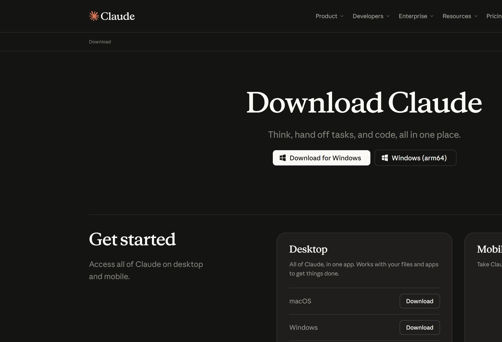
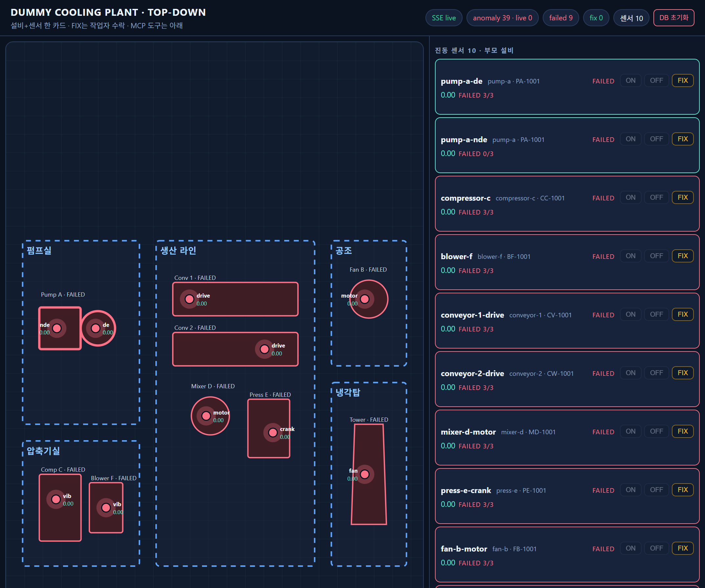
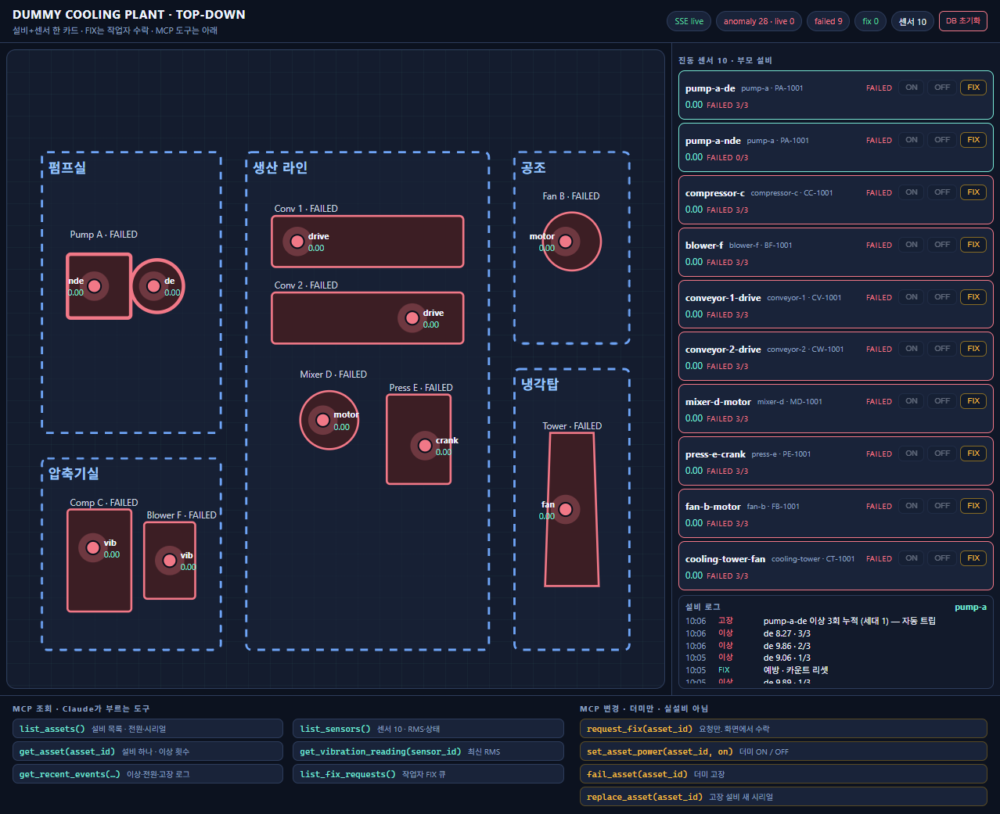
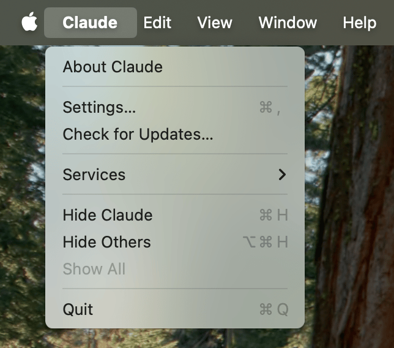
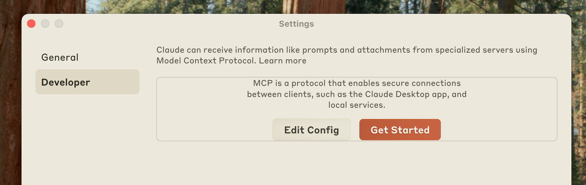

# 더미 공장 + Claude Desktop

코딩 없이, **가짜 공장**을 켜고 **Claude Desktop**이 센서 값을 도구로 읽게 하는 실습입니다.

Windows와 Mac 모두 됩니다.

- 공장 지도: http://localhost:8000
- 챗봇: Claude Desktop (브라우저 Claude가 아님)
- API 키 없음 · Docker 없음

슬라이드: [slides/예지보전_에이전트_실습.pptx](slides/예지보전_에이전트_실습.pptx) · 수강생: [docs/STUDENT.md](docs/STUDENT.md) · 진행자: [docs/INSTRUCTOR.md](docs/INSTRUCTOR.md)

**오늘 할 일**

1. Claude Desktop 설치하고 로그인
2. `uv` 설치
3. 공장 켜기
4. Claude에 MCP 붙이기
5. Skill을 붙여 질문하기

터미널은 Windows면 **PowerShell**, Mac이면 **터미널(Terminal)** 또는 iTerm을 쓰면 됩니다.

---

## 1. Claude Desktop 설치

브라우저 Claude(claude.ai)와 **데스크톱 앱**은 다릅니다. MCP(로컬 공장 도구)는 데스크톱 앱에서만 붙습니다.

1. [claude.com/download](https://claude.com/download) 를 엽니다.
2. 본인 OS에 맞는 버튼을 받습니다.
   - **Windows:** `Download for Windows` (일반 PC). ARM 노트북만 `Windows (arm64)`
   - **Mac:** Desktop 카드의 **macOS → Download** (Apple Silicon / Intel 같은 설치 파일)
3. 설치합니다.
   - Windows: 받은 `.exe`를 실행
   - Mac: 받은 `.dmg`를 열고 **Claude**를 Applications(응용 프로그램)으로 끌어다 놓기. 처음 열 때 경고가 나면 우클릭 → 열기
4. 앱을 열고 **같은 Claude 계정**으로 로그인합니다. 무료 플랜으로 실습할 수 있습니다.



설치가 끝나면

- Windows: 시작 메뉴에 **Claude**
- Mac: Launchpad 또는 Applications에 **Claude**

가 보여야 합니다.

---

## 2. uv 설치

Python 패키지를 받아 실행하는 도구입니다. 한 줄이면 됩니다.

**Windows (PowerShell)**

```powershell
irm https://astral.sh/uv/install.ps1 | iex
```

**Mac (터미널)**

```bash
curl -LsSf https://astral.sh/uv/install.sh | sh
```

Homebrew를 쓰는 Mac이면 `brew install uv` 도 됩니다.

설치가 끝나면 **터미널을 완전히 닫았다가 다시** 열고 확인합니다.

```bash
uv --version
```

버전이 나오면 성공입니다.

Mac에서 `command not found: uv` 이면 PATH가 안 잡힌 것입니다. 아래를 한 번 실행한 뒤 터미널을 다시 여세요.

```bash
echo 'export PATH="$HOME/.local/bin:$PATH"' >> ~/.zshrc
source ~/.zshrc
```

(bash를 쓰면 `~/.zshrc` 대신 `~/.bash_profile`)

---

## 3. 공장 켜기

이 저장소를 받은 뒤 `playground` 폴더에서:

```bash
cd playground
uv run plant
```

첫 실행은 패키지를 받느라 조금 걸립니다. 아래처럼 나오면 된 것입니다.

```text
factory map     http://0.0.0.0:8000/
```

브라우저에서 [http://localhost:8000](http://localhost:8000) 을 엽니다. **이 터미널은 끄지 마세요.** 공장이 살아 있어야 Claude가 지금 값을 읽습니다.



화면 **맨 아래**에 Claude가 부르는 MCP 도구 이름이 있습니다. 조회(파란 이름)와 변경(노란 이름)이 나뉘어 있습니다.



펌프가 빨갛거나 FAILED여도 고장 난 실습이 아닙니다. 더미가 일부러 이상을 냅니다.

---

## 4. Claude Desktop에 공장 붙이기 (MCP)

MCP는 Claude가 **내 컴퓨터의 프로그램**을 도구처럼 부르는 연결입니다. 오늘은 웹 URL이 아니라 **stdio**(로컬 프로세스)입니다.

### 4-1. 설정 넣기

공장을 켠 채로, **다른 터미널**에서 다시 `playground`로 갑니다.

```bash
cd playground
uv run claude-config
```

이 명령이 Claude 설정 파일에 `dummy-plant`를 넣습니다. Python과 `start_plant_mcp.py`의 **절대 경로**를 씁니다.

- Windows: `playground\.venv\Scripts\python.exe`
- Mac: `playground/.venv/bin/python`

### 4-2. Claude를 완전히 종료했다가 다시 열기

창만 닫으면 백그라운드에 남아 **설정이 안 읽힙니다.**

**Windows**

1. 오른쪽 아래 트레이(숨겨진 아이콘)에서 Claude를 우클릭
2. 종료 / Quit
3. 시작 메뉴에서 Claude를 다시 실행

**Mac**

1. 화면 **맨 위** 메뉴 막대에서 **Claude → Quit Claude** (단축키 `Cmd+Q`)
2. Dock의 빨간 점만 누르거나 창의 빨간 신호등만 누르면 **종료가 아닙니다**
3. Spotlight(`Cmd+Space`) 또는 Applications에서 Claude를 다시 실행

### 4-3. 연결 확인

Claude **창 안**의 계정 설정이 아닙니다. 앱 메뉴에서 Settings를 엽니다.

- **Windows:** Claude 창 메뉴 → **Settings**
- **Mac:** 화면 맨 위 **Claude → Settings...** (스크린샷과 같음)



왼쪽에서 **Developer**를 고릅니다. **dummy-plant**가 보이고 에러가 없으면 성공입니다. `Edit Config`로 설정 파일을 직접 열 수도 있습니다.



<small>Settings / Developer 화면은 [MCP 공식 문서](https://modelcontextprotocol.io/docs/develop/connect-local-servers)의 안내 이미지입니다. 우리 서버 이름은 filesystem이 아니라 **dummy-plant** 입니다.</small>

새 채팅을 열고, 입력창 근처의 도구/커넥터 목록에 **dummy-plant** 도구(`list_sensors` 등)가 보이는지 확인합니다.

### 직접 JSON을 고치고 싶을 때

대부분 `uv run claude-config`면 충분합니다. 손으로 고칠 때만 펼치세요.

<details>
<summary>설정 파일 위치와 JSON 예제</summary>

Claude → Settings → Developer → **Edit Config**

| OS | 파일 |
| --- | --- |
| Windows | `%APPDATA%\Claude\claude_desktop_config.json` |
| Windows (Store) | `%LOCALAPPDATA%\Packages\Claude_pzs8sxrjxfjjc\LocalCache\Roaming\Claude\claude_desktop_config.json` |
| Mac | `~/Library/Application Support/Claude/claude_desktop_config.json` |

경로의 `이름`과 저장소 위치를 **본인 컴퓨터의 절대 경로**로 바꿉니다. 먼저 `uv run plant`를 한 번 해서 `.venv`가 있어야 합니다.

**Windows**

```json
{
  "mcpServers": {
    "dummy-plant": {
      "command": "C:\\Users\\이름\\ws\\sensor-agent-tutorial\\playground\\.venv\\Scripts\\python.exe",
      "args": [
        "C:\\Users\\이름\\ws\\sensor-agent-tutorial\\playground\\start_plant_mcp.py"
      ],
      "cwd": "C:\\Users\\이름\\ws\\sensor-agent-tutorial\\playground"
    }
  }
}
```

**Mac**

```json
{
  "mcpServers": {
    "dummy-plant": {
      "command": "/Users/이름/ws/sensor-agent-tutorial/playground/.venv/bin/python",
      "args": [
        "/Users/이름/ws/sensor-agent-tutorial/playground/start_plant_mcp.py"
      ],
      "cwd": "/Users/이름/ws/sensor-agent-tutorial/playground"
    }
  }
}
```

저장한 뒤 Claude를 **완전히 종료**하고 다시 엽니다. (Windows 트레이 / Mac `Cmd+Q`)

</details>

---

## 5. 채팅

1. [playground/skills/vibration-pdm.md](playground/skills/vibration-pdm.md) **전체**를 프로젝트 지시 또는 첫 메시지에 붙여 넣습니다.
2. 질문은 [docs/STUDENT.md](docs/STUDENT.md) 순서대로 타이핑합니다.

답이 공장 JSON과 다르면 도구를 안 부른 것입니다. 그게 오늘 핵심입니다.

---

## 막히면

| 증상 | 먼저 볼 것 |
| --- | --- |
| dummy-plant가 없거나 `Server disconnected` | Claude를 완전히 종료했는지 (Win 트레이 / Mac `Cmd+Q`). `uv run plant`를 한 번 해서 `.venv`가 있는지 |
| `http://localhost:8000` 이 안 열림 | 공장 터미널이 살아 있는지. 다른 프로그램이 8000을 쓰는지 |
| 숫자를 지어 냄 | Skill을 안 붙였거나, 공장보다 Claude만 켠 경우 |
| `uv`를 못 찾음 | 설치 후 터미널을 새로 열었는지. Mac은 `~/.local/bin` PATH |

로그

- Windows: `%APPDATA%\Claude\logs`
- Mac: `~/Library/Logs/Claude`
